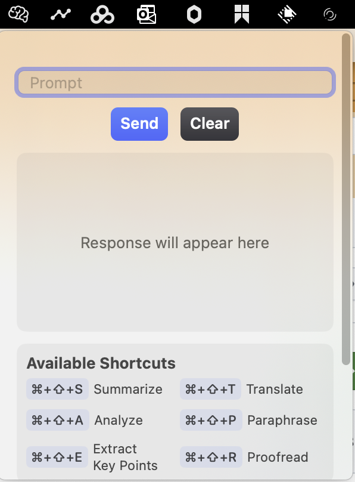

# Clipllm

ClipLLM is a Swift-based application developed using [cursor.ai](https://cursor.ai). It provides an interface to chat with a local Large Language Model (LLM) powered by [Ollama](https://ollama.com).

## Features

1. **Interface to Chat with Ollama**:

   - ClipLLM offers a seamless interface to interact with Ollama, allowing users to have conversations with a local LLM.

2. **Shortcut to Interact with Clipboard**:

   - The application includes shortcuts to quickly interact with the clipboard, making it easy to copy and paste text during conversations.

3. **Show the Content of Clipboard**:
   - ClipLLM can display the current content of the clipboard, providing a convenient way to view and manage clipboard data.

## Installation

To install ClipLLM, follow these steps:

1. Clone the repository:

   ```sh
   git clone https://github.com/yourusername/ClipLLM.git
   ```

2. Navigate to the project directory:

   ```sh
   cd ClipLLM
   ```

3. Open the project in Xcode:

   ```sh
   open ClipLLM.xcodeproj
   ```

4. Build and run the project in Xcode.

## Usage

Once the application is running, you can use the following features:



### Chat with Ollama

- Open the chat interface and start typing your queries. The local LLM powered by Ollama will respond to your inputs.

### Clipboard Interaction

- Use the provided shortcuts to copy text to the clipboard or paste text from the clipboard into the chat interface.

### View Clipboard Content

- Access the clipboard viewer to see the current content of your clipboard. This feature is useful for managing and verifying the text you are working with.

## Contributing

We welcome contributions to ClipLLM! If you have any ideas, suggestions, or bug reports, please open an issue or submit a pull request.

## License

This project is licensed under the MIT License. See the [LICENSE](LICENSE) file for more details.

## Acknowledgements

- [cursor.ai](https://cursor.ai) for providing the development tools.
- [Ollama](https://ollama.com) for powering the local LLM.

For more information, please visit our [GitHub repository](https://github.com/yourusername/ClipLLM).
